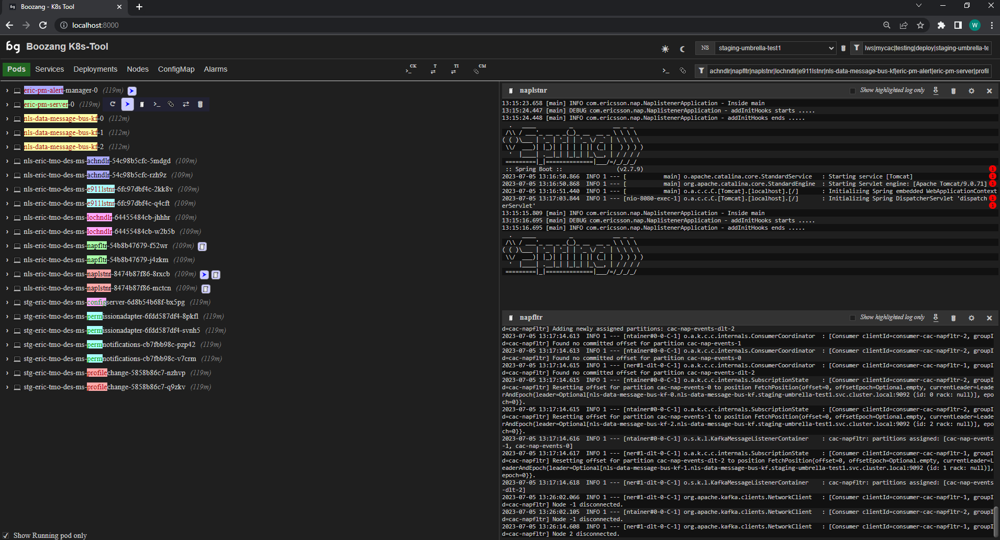

# Kubernetes Management Tool (NodeJS)

The Kubernetes Management Tool is a powerful and user-friendly application built in NodeJS that simplifies the management and monitoring of Kubernetes clusters. With this tool, you can efficiently handle the deployment, scaling, and monitoring of your applications running on Kubernetes.

## Features

- **Cluster Management**: Easily connect to your Kubernetes clusters and manage them from a single interface. 
  
- **Remote command execution**: Run commands on an individual pod, and bookmark your favourite commands. 

- **Quick ramp-up for your team**: Customize the tool with useful commands for your project, and distribute the configuration file in your team.

- **Monitoring**: Monitor and setup alarm thresholds on CPU, memory, and disc usage, 

- **Logging**: Follow logs from several pods at once, highlight keyworks and merge duplicates. Download and screenshot logs for bug reporting. 

## Pre-conditions

To run `k8s-tool`, you'll need to have **NodeJS** installed. You also have a working **Kubernetes** enviroment and at least one namespace. 

Make sure that you can run: `kubectl get namespace` successfully. 

## Installation

Follow these steps:

1. Clone this repository: `git clone https://github.com/Boozang-Technologies/k8s-tool`
2. Navigate to the project directory: `cd k8s-tool`
3. Install dependencies using npm: `npm install`
4. Start tool: `npm start`
5. Open your browser and navigate to `http://localhost:8866` to access the tool's web interface.

## Configuration

The settings file (`config/env/setting.txt`) allows you to customize the tool based on your specific requirements. All these seetings can be set in the tool, and will be saved here to persist your settings between sessions. This means you can keep many configurations, and simply swap this file out between settings.

To remove all your customization, simply remove `settings.txt` and restart the tool.

## Contributing

Contributions are welcome! If you encounter any issues, have feature requests, or want to contribute to the project, please create an issue or submit a pull request in the [GitHub repository](https://github.com/your-username/kubernetes-management-tool).

## License

This project is licensed under the [MIT License](LICENSE).

## Acknowledgements

k8s-tool is built using the following technologies

- [Node.js](https://nodejs.org/)
- [Express](https://expressjs.com
- [Boozang Framework](https://github.com/Boozang-Technologies/boozang-fm)
